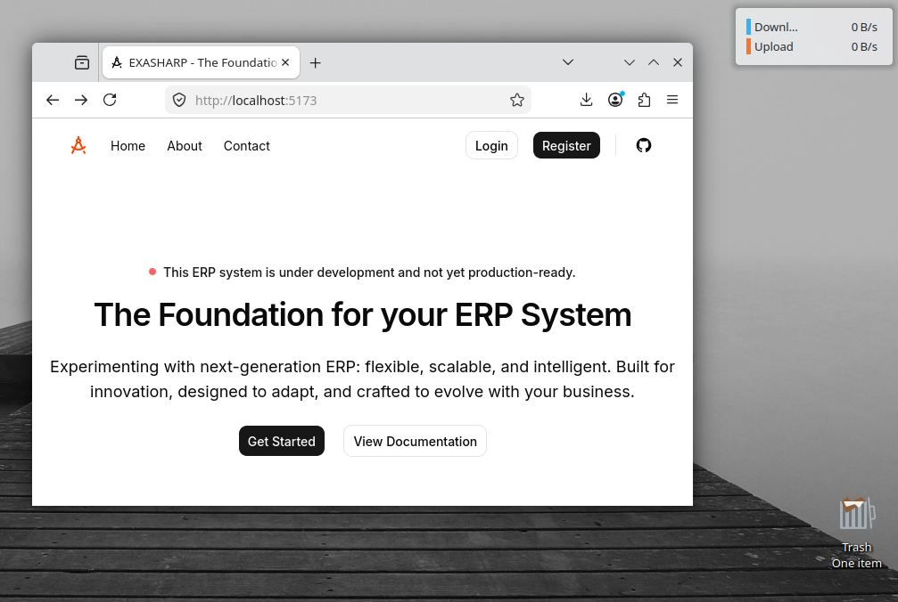

<div align="center">
  
  
  # Exasharp ERP
  ### *Enterprise Resource Planning Made Simple*
  
  
  
  []()
  []()
  []()
</div>

---

## 🚀 About The Project

Exasharp ERP is a modern enterprise resource planning solution currently in **active development**. Built with performance and scalability in mind, it aims to streamline business operations through an intuitive interface.

> ⚠️ **Development Status:** Not for production use. APIs and features are subject to change.

---

## ✨ Features (In Progress)

| Module | Description |
|--------|-------------|
| 📊 **Dashboard** | Real-time business analytics |
| 👥 **User Management** | Role-based access control |
| 📦 **Inventory** | Stock tracking and management |
| 💰 **Finance** | Invoicing and expense tracking |
| 📈 **Reports** | Customizable reporting tools |

---

## 🛠️ Tech Stack

- **Runtime:** [Bun](https://bun.sh) - Fast JavaScript runtime
- **Frontend:** React with TypeScript
- **Backend:** Node.js / Express
- **Database:** PostgreSQL

---

## 🏃‍♂️ Getting Started

### Prerequisites
- [Bun](https://bun.sh) installed on your system

### Installation & Running

```bash
# Install all dependencies
bun install:all

# Start development server
bun run dev